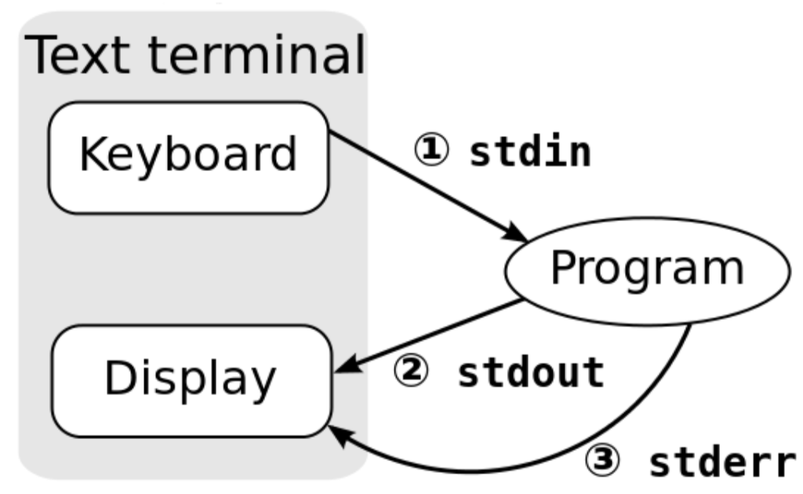

# Week 2 - Lecture 1

* Rishab Ketan Doshi
* Lab 7
* April 9

## Topics
* Environment Variables and Path
* Locales
* Encoding
* Wildcards recap
* Regular Expressions
* Commands
	* grep
	* sort
	* comm
	* tr 
* Pipelining and Redirection
* Shell scripting basics

## Note

* Material taken from various internet sources, TA's slides from past offerings of CS35L
* For future assignments we will be using a hardware device called Beaglebone - details available on [class website](https://web.cs.ucla.edu/classes/spring19/cs35L/syllabus.html).
* For every new command we discuss, strongly recommend that you check the man pages - build the habit of reading and digesting documentation.
* Office hours - 9.30 AM - 11.30 AM - Fridays.

### Some useful hacks ;)
* Want to look through your past executed commands. Try the `history ` command.
* Want your terminal to auto-complete when you have typed a command previously?
Press `ctrl + r` and then type your command.
* How to effectively read man pages?
	search within the man page by hitting `/<pattern_to_search>` To jump through the results, press `N` (forwards) and `Shift+N ` (backwards).
* Somebody knows any others?

## Environment Variables & Path

* As name suggests, these are variables. Similar to your classic `<variable_name> =  <variable_value>`
* These are like global variables and available to all the processes that are run by the current user.
* How to find the currently set environment variables ?
	
	Paste below code snippet onto your terminal and inspect the output.
	
	```
	env
	
	```
	
* How to use/access environment variables? `$<variable_name>`.
	Example: ` echo $USER`
	
* Path - specifies all directories to search for while looking for a file/command. When you type anything, the shell looks for it in the currently specified directory first, if not found, it will look at each of the directories in the path.

## Locales
* Has anybody used an app that works differently in different locations?
Ex: Uber shows trip fare in Dollars when I am in LA and in Rupees when I am in India. This is the classic use-case of locales
* Can anyone think of any other examples?
* locales help us achieve this. Specifically they are parameters that define a user's cultural preferences.
	* Language
	* Country
	* Currency
	* Other area specific properties

* Wikipedia : 

	<i><b>"</b>a locale is a set of parameters that defines the user's language, region and any special variant preferences that the user wants to see in their user interface. Usually a locale identifier consists of at least a language code and a country/region code.<b>"</b></i>

* How to find the locale command? `man -k locale`

* `locale` command : prints information about the current locale environment 	to standard output.
* The C - locale is the default locale. 
	* Earlier when unix was written and not really used across the world, there were a lot of defaults that were used. This is in the c-locale.
* Locale settings affect program behavior 
	* `LC_COLLATE='C'`: sorting is in ASCII order
	* `LC_COLLATE='en_US'`: sorting is case insensitive except when the two strings are otherwise equal and one has an uppercase letter earlier than the other.
	* Example:
		 
		 `en_us`  | `C`
------------- | -------------
A  | A
a  | Z
Z  | a
z | z

	#### TODO
	* Exercise : 
		What are the locale parameters for 
		* Date and time formats
		* Order for comparing and sorting
		* Non-monetary numeric formats

	* Solutions:
		* Date and time formats: LC_TIME
		* Order for comparing and sorting: LC_COLLATE

## Character Encoding
* Words and sentences in text created from characters.
* The characters are stored in the computer as one or more bytes.
* To refer to characters in an unambiguous way, there is a number associated with each character referred to as a code-point.
* Character encoding is like a table that maps the code-points to the actual character representation, so that computer can <b>encode</b> and <b>decode</b> the actual representation.
* Characters that are needed for a specific purpose are grouped into a character set. 
* Many different character encodings : UTF-8, ASCII 
* Many different character sets : ASCII, Unicode

## Wildcards Recap


* `*` - 0 or more of the preceding character

	Ex: `abc*` -  matches a string that has ab followed by zero or more c 

* `+` - 1 or more of the preceding character

	Ex: `abc+`- matches a string that has ab followed by one or more c
*  `?` - 0 or 1 of the preceding character

	Ex: `abc?` - matches a string that has ab followed by zero or one c

* [a-z] or [A-Z] or [0-9] - matches characters that belong to the stated range.

## Regular Expressions

* Powerful notations that let you create complex patterns to search for text. 
* Think of these are more powerful wildcards.
* Example usecase: I am reading the Harry Potter book and I want to identify names of all the elves in Hogwarts. I know that all elf names start with e and last character as y and the fourth character is an uppercase S or G or H or R (names of houses). Ex: ebby or eddy or edoby or ey. 

*Below Examples from [here](https://medium.com/factory-mind/regex-tutorial-a-simple-cheatsheet-by-examples-649dc1c3f285).

#### regex - Anchors

Anchors — ^ and $

Ex:

* `^The`        matches any string that starts with The

* `end$`        matches a string that ends with end

* `^The end$`   exact string match (starts and ends with The end)

*  `roar`       matches any string that has the text roar in it


#### regex - Quantifiers

Quantifiers — * + ? and {}

* `abc*`        matches a string that has ab followed by zero or more c
* `abc+`        matches a string that has ab followed by one or more c
* `abc?`        matches a string that has ab followed by zero or one c
* `abc{2}`      matches a string that has ab followed by 2 c
* `abc{2,}`     matches a string that has ab followed by 2 or more c
* `abc{2,5}`    matches a string that has ab followed by 2 up to 5 c
* `a(bc)*`      matches a string that has a followed by zero or more copies of the sequence bc
* `a(bc){2,5}`  matches a string that has a followed by 2 up to 5 copies of the sequence bc.

#### regex - OR operator 

OR operator — | or []

* `a(b|c)`     matches a string that has a followed by b or c 
* `a[bc]`      same as previous

#### regex - Bracket expressions — []
* `[abc]` matches a string that has either an a or a b or a c -> is the same as `a|b|c `
* `[a-c]` same as previous
* `[a-fA-F0-9]` a string that represents a <b>single hexadecimal digit, case insensitively </b>
* `[0-9]%`           a string that has a character from 0 to 9 before a % sign
* `[^a-zA-Z]`        a string that has not a letter from a to z or from A to Z. <b>In this case the ^ is used as negation of the expression </b>

#### regex - POSIX Bracket Expressions ([src](https://www.regular-expressions.info/posixbrackets.html))
* `[:alnum:]`	Alphanumeric characters
* `[:alpha:]`	Alphabetic characters	
* `[:ascii:]`	ASCII characters	
* `[:blank:]`	Space and tab	
* `[:cntrl:]`	Control characters	
* `[:digit:]`	Digits	* `[0-9]`	
* `[:graph:]`	Visible characters (anything except spaces and control characters)
* `[:lower:]`	Lowercase letters	
* `[:print:]`	Visible characters and spaces (anything except control characters)	
* `[:punct:]`	Punctuation (and symbols)
* `[:space:]`	All whitespace characters, including line breaks	
* `[:upper:]`	Uppercase letters	
* `[:word:]`	Word characters (letters, numbers and underscores)
* `[:xdigit:]`	Hexadecimal digits


### Basic Regular Expressions 

* In basic regular expressions the meta-characters `‘?’, ‘+’, ‘{’, ‘|’, ‘(’, and ‘)’` lose their special meaning
* To use them with their special meaning ; use the backslashed versions `‘\?’, ‘\+’, ‘\{’, ‘\|’, ‘\(’, and ‘\)’`
* The reason is that the oldest versions of UNIX grep did not support these special meta characters. The developers of grep wanted to keep it compatible with existing regular expressions, which may use these characters as literal characters.
* standard mode for sed and grep commands
* Example: 
	* If the string is `a+b=c` and we want a BRE to match this 'literally'(including the + sign) we would use the pattern `a+b`
	* One or more ‘a’ characters followed by ‘b’ (plus sign as special meta-character), we would use the pattern `'a\+b'`
	


### Extended Regular Expressions 

* "Extended" is relative to the original UNIX grep, which only had bracket expressions, dot, caret, dollar and star.
* Can use metacharacters without backslashes.
* Use backslashes to suppress the meaning of all metacharacters, just like in modern regex flavors
* for commands like `sed`, `grep` use the -E option to use ERE's
* Example:
	* If the string is `a+b=c` and we want a BRE to match this 'literally'(including the + sign) we would use the pattern `a\+b`
	* One or more ‘a’ characters followed by ‘b’ (plus sign as special meta-character), we would use the pattern `'a+b'`

#### regex - Exercises 
* Regexone - https://regexone.com/lesson/introduction_abcs
* Regexcrossword - https://regexcrossword.com/


## More Commands

*[src](https://github.com/tldr-pages/tldr)

### `grep`

Matches patterns in input text. Supports simple patterns and regular expressions.

  - Search for an exact string:
  
   `grep search_string path/to/file ` 

  - Search in case-insensitive mode:

	`grep -i search_string path/to/file `

  - Search recursively (ignoring non-text files) in current directory for an exact string:
    
    `grep -RI search_string .`

  - Use extended regular expressions (supporting ?, +, {}, () and |):
    
    `grep -E ^regex$ path/to/file`

  - Use the standard input instead of a file:
    
    `cat path/to/file | grep search_string`

  - Invert match for excluding specific strings:
    
    `grep -v search_string`

### `tr`
  Translate characters: run replacements based on single characters and character sets.

  - Replace all occurrences of a character in a file, and print the result:

    `tr find_character replace_character < filename`

  - Replace all occurrences of a character from another command's output:
  
    `echo text | tr find_character replace_character`

  - Map each character of the first set to the corresponding character of the second set:
  
    `tr 'abcd' 'jkmn' < filename`

  - Delete all occurrences of the specified set of characters from the input:
    
    `tr -d 'input_characters' < filename`

  - Compress a series of identical characters to a single character:

    `tr -s 'input_characters' < filename`

  - Translate the contents of a file to upper-case:
    
    `tr "[:lower:]" "[:upper:]" < filename`
    
  - use the complement of
    
    `tr "[:lower:]" "[:upper:]" < filename`
    
### `sort`

Sort lines of text files. (sort order dependent on locale)

  - Sort a file in ascending order:

    `sort filename`

  - Sort a file in descending order:

    `sort -r filename`

  - Sort a file in case-insensitive way:

    `sort --ignore-case filename`

  - Sort a file using numeric rather than alphabetic order:

    `sort -n filename`


### `comm`

Compare sorted files line by line.

  - Produce three tab-separated columns: lines only in first file, lines only in second file and common lines:
    
    `comm file1 file2`

  - Print only lines common to both files:
    
    `comm -12 file1 file2`

  - Print only lines common to both files, reading one file from stdin:
    
    `cat file1 | comm -12 - file2`

  - Get lines only found in first file, saving the result to a third file:
    
    `comm -23 file1 file2 > file1_only`

  - Print lines only found in second file, when the files aren't sorted:
    
    `comm -13 <(sort file1) <(sort file2)`

## Piping and Redirection

3 streams to interact with ; 

* stdin
* stdout
* stderr(defaults to stdout)



### Redirecting to a File
* Normally, we will get our output on the screen, which is convenient most of the time, but sometimes we may wish to save it into a file to keep as a record, feed into another system, or send to someone else.

```
ls -l > fileList
```

* Append data to an existing file

```
ls -l >> fileList
```

### Redirecting from a File
* If we use the less than operator ( < ) then we can send data the other way. We will read data from the file and feed it into the program via it's STDIN stream.

```
wc -l < fileList
```

### Combining redirections
```
wc -l < fileList > myoutput
```

### Piping
* A mechanism for sending data from one program to another.

```
ls -l | head -3
```

* Pipe as many programs together as we like
```
ls -l | head -3 | tail -1
``` 

## Quotes
Three kinds of quotes  

* Single quotes ' '
	* Do not expand at all, literal meaning 
	* Try `temp='$hello$hello' ; echo $temp	`

* Double quotes " "
	* Almost like single quotes but expand backticks and $

* Backticks ` ` or $()
	* Expand as shell commands 
	* Try `temp=`ls`; echo $temp`

* Exercise:

```
$ a=pwd
$ echo '$a' 
$ echo "$a" 
$ echo `$a`
```

## Shell Scripting Basics

* Shell is a user-interface to the Operating System
* Accepts commands as text, interprets them and uses OS API to open files, start program, send packets over the network
* All commands we have been running so far, can be written as a script that the shell executes.
* What is an interpreted vs compiled language?
* When shell script is executed a new child “shell” process is spawned to run it.
* The first line of the script is used to state which child “shell” to use `#! /bin/sh ` , `#! /bin/bash`
* Example: Shell script to print `Hello world`

```
#! /bin/sh
echo 'Hello World'

```
### Variables in Shell Scripts

```
#! /bin/sh
variable = "Hi, I am a variable"
echo $variable
```

### Passing command line arguments to shell scripts 

* Argument number num is accessed using `${var_num}`. 
* enclose the number in braces if it’s greater than 9: `echo "tenth arg is ${10}"`

```
#! /bin/sh
echo “First Argument is $1”
```

`./shell arg`

### if statements

```
#!/bin/bash

if [ $1 –gt 0 ] then
	echo "Positive number" 
else
	echo "Negative number"
fi

```

### Running Shell Scripts
* run shell script by typing `./script_name.sh` into the shell.


Questions:

* What permission does it need to run?
* Why ./script_name?


## Exercises

* Print out all the commands that have been typed out no your terminal that have a `.txt` in the command. Ex: If you have typed out `cat test.txt` ; `echo test.txt` ; `vi test.txt` in the past, you should display all these commands on separate lines
* Get a count of number of times you have created a directory in your system
* You have to decode the below secret message, keymap is `!@#$%^&*()` with `abcdefghi`. Decode the message.

```
T()s )s 35L. I !m TA)n* t()s #ours% &or t(% &)rst t)m%. I know t()s #ours% s%%ms ^)&&)#ult :/ , ^ont worry, w% w)ll l%!rn t()s m!t%r)!l to*%t(%r!

By t(% w!y, G!m% o& T(ron%s r%l%!s%s t()s w%%k%n^, Ar% you !ll %x#)t%^?

V!l!r Mor*(ul)s

```

* Create 2 files(copy paste onto your terminal) : 
	* file 1 _ from content [here](https://gist.githubusercontent.com/rishabkdoshi/c5bd3e5a195029658fad90706c0bdcfc/raw/0ecfa0c7594d858e88b641e63587063a15776c31/file1.html)
	* file 2 from content [here](https://gist.githubusercontent.com/rishabkdoshi/1d30fce7ed6311451f50ebfbe245d804/raw/7bec3bc913b13264f266ac4c43d9a2c350f8dc67/file2.html)

Compare the content in these files and print out lines in file2 that are not in file1.

* Take a directory as input and find the third file in alphabetical order in that directory 
* create a shell script that creates a directory with name of the first argument and create two files in the directory


## References
* https://www.w3.org/International/questions/qa-what-is-encoding
* https://medium.com/factory-mind/regex-tutorial-a-simple-cheatsheet-by-examples-649dc1c3f285
* https://www.regular-expressions.info/posix.html
* http://pubs.opengroup.org/onlinepubs/9699919799/basedefs/V1_chap07.html#tag_07
* https://www.regular-expressions.info/posix.html
* https://www.gnu.org/software/grep/manual/html_node/Basic-vs-Extended.html