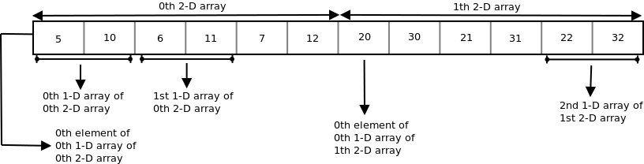
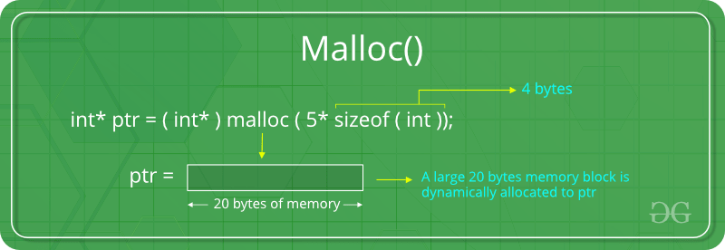
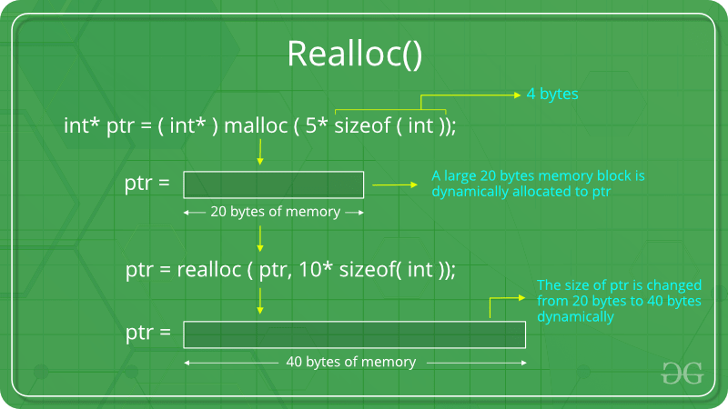

# Learning By Doing - C programming
* C - Programming
* CS35L - Week 4, Spring 2019
* Rishab Ketan Doshi


## Acknowledgments
* Some of the examples below are taken / extended from CS35L-Lab1 - Nandan Parikh's discussion.
* Many of the examples below are taken / extended from geeksforgeeks.org

## Index
1. Basics
2. Pointers
3. structs
4. Dynamic Memory
5. getChar, putchar

## Basics

* Many constructs in C similar to C Plus Plus
	* if-else statements
	* for loops
	* while loops
	* do while loops
	* switch statements
* Many subtle differences like
* No classes in C, only structs
* Can't initialize the variable inside for loops. 

### Example 1 - Data-types + Sizes

* Different data Types in C
* Use sizeof operator to get no. of bytes occupied for the variable

[src](https://www.geeksforgeeks.org/data-types-in-c/)


Create filename : `dataTypes.c`

```c
#include <stdio.h> 
int main() 
{ 
	int a = 1; 
	char b ='G'; 
	double c = 3.14; 
	printf("Hello World!\n"); 

	//printing the variables defined above along with their sizes 
	printf("Hello! I am a character. My value is %c and "
		"my size is %lu byte.\n", b,sizeof(char)); 
	//can use sizeof(b) above as well 

	printf("Hello! I am an integer. My value is %d and "
		"my size is %lu bytes.\n", a,sizeof(int)); 
	//can use sizeof(a) above as well 

	printf("Hello! I am a double floating point variable."
		" My value is %lf and my size is %lu bytes.\n",c,sizeof(double)); 
	//can use sizeof(c) above as well 

	printf("Bye! See you soon. :)\n"); 

	return 0; 
} 
 
```

## Pointers

### Example 2 - Pointers Basics

Below program 

* Defines a pointer variable
* Assigns it a value
* Prints the address of variable


create file: `pointerBasics.c`

[src](https://www.tutorialspoint.com/cprogramming/c_pointers.htm)	

```c
#include <stdio.h>

int main () {

   int  var = 20;   /* actual variable declaration */
   int  *ip;        /* pointer variable declaration */

   ip = &var;  /* store address of var in pointer variable*/

   printf("Address of var variable: %x\n", &var  );

   /* address stored in pointer variable */
   printf("Address stored in ip variable: %x\n", ip );

   /* access the value using the pointer */
   printf("Value of *ip variable: %d\n", *ip );

   return 0;
}
```

<a href="https://www.geeksforgeeks.org/double-pointer-pointer-pointer-c/"> </a> 

### Example 3 - Mulitple Level of Pointers


```c
#include<stdio.h>

int main() {

	int x = 7;
	int *p;
	p = &x;

	printf("Value of x : %d\n",x);
 	printf("Value of p : %p\n",p);
 	printf("Value of *p : %d\n",*p);
 	printf("Value of &x (Address) : %p\n", &x);
 	printf("Value of &p : %p\n", &p);

 	int **q;

 	q = &p;

 	printf("Result of *q is %p\n", *q);
 	printf("Result of q is %p\n", q);
 	printf("Result of **q is %d\n", **q);
 	printf("Result of &q is %p\n", &q);

	int ***r;
	
	r = &q;
	
 	printf("Result of *r is %p\n", *r);
 	printf("Result of r is %p\n", r);
 	printf("Result of **r is %d\n", **r);
 	printf("Result of ***r is %d\n", ***r);
 	printf("Result of &r is %p\n", &r);
 	
 	return 0;

}
```


### Example 4 - Pointers and 1-D Arrays

```c
#include<stdio.h>

int main() {
	
	int A[5] = {1,3,5,7,9};

	printf("Value of A[0] : %d\n" , A[0]);

	printf("Value of A %p\n", A);

	printf("Value of &A[0] %p\n", &A[0]);

	printf("Value of A + 2 : %p\n", A + 2);

	int *point;

	point = &A[0];

	printf("Value of *point : %d\n", *point);

	printf("Value of *(point + 2) : %d\n", *(point + 2));


	char B[2] = {'C','S'};

	printf("Value of B[1] : %c\n" , B[1]);

	printf("Value of B %p\n", B);

	printf("Value of &B[0] %p\n", &B[0]);

	printf("Value of B + 1 : %p\n", B + 1);

}
```


### Example 5 - Pointers and 2d arrays

[src](https://www.geeksforgeeks.org/pointer-array-array-pointer/)

```c
// C program to print the values and 
// address of elements of a 2-D array 
#include<stdio.h> 

int main() 
{ 
int arr[3][4] = { 
					{ 10, 11, 12, 13 }, 
					{ 20, 21, 22, 23 }, 
					{ 30, 31, 32, 33 } 
				}; 
int i, j; 
for (i = 0; i < 3; i++) 
{ 
	printf("Address of %dth array = %p %p\n", 
					i, arr[i], *(arr + i)); 
	
	for (j = 0; j < 4; j++) 
	printf("%d %d ", arr[i][j], *(*(arr + i) + j)); 
	printf("\n"); 
} 

return 0; 
} 

```

* Both the expressions `(arr + i)` and `*(arr + i)` are pointers, but their base type are different. The base type of `(arr + i)` is 'an array of 4 units' while the base type of `*(arr + i)` or `arr[i]` is int.

* To access an individual element of our 2-D array, we should be able to access any jth element of ith 1-D array.

* Since the base type of `*(arr + i)` is int and it contains the address of 0th element of ith 1-D array, we can get the addresses of subsequent elements in the ith 1-D array by adding integer values to `*(arr + i)`.
* For example `*(arr + i) + 1` will represent the address of 1st element of 1stelement of ith 1-D array and `*(arr+i)+2` will represent the address of 2nd element of ith 1-D array.
* Similarly `*(arr + i) + j` will represent the address of jth element of ith 1-D array. On dereferencing this expression we can get the jth element of the ith 1-D array.

### Example 6 - Memory Representation of multi-dimensional arrays

Since memory in computer is organized linearly it is not possible to store an multi-dimensional array in rows and columns. The concept of rows and columns is only theoretical, actually a 2-D/3-D array is stored in row major order i.e rows are placed next to each other. The following figure shows how the below 3-D array will be stored in memory.

```c
int arr[2][3][2] = { {{5, 10}, {6, 11}, {7, 12}}, {{20, 30}, {21, 31}, {22, 32}} };

```



### Example 7 - Pointers and Character Arrays

```c
#include<stdio.h>

char *c[] = {"the","quick brown fox", "jumped", "over the", "lazy dog"};
char **cp[] = {c+3, c+2, c+1, c, c+4};
char ***cpp = cp;

int main() {

 printf("%s\n", *(c + 1));
 printf("%s\n", *(c + 2));
 printf("%s\n", **(cpp+3));
 printf("%s\n", **(cp+4)+4);
 printf("%s\n", **(++cpp));
 printf("%s\n", **cp);
 printf("%s\n", **(++cpp)+5);
 return 0;

}

```

### Example 8 - Function Pointers Basics

* Can also have pointers pointing to executable code like functions in C.

```c
#include <stdio.h> 
// A normal function with an int parameter 
// and void return type 
void fun(int a) 
{ 
    printf("Value of a is %d\n", a); 
} 
  
int main() 
{ 
    // fun_ptr is a pointer to function fun()  
    void (*fun_ptr)(int) = &fun; 
  
    /* The above line is equivalent of following two 
       void (*fun_ptr)(int); 
       fun_ptr = &fun;  
    */
  
    // Invoking fun() using fun_ptr 
    (*fun_ptr)(10); 
    
    void (*another_fun_ptr)(int) = fun; // & removed 

	another_fun_ptr(20); // * removed 
    return 0; 
}
```

### Example 9 - Function Pointer as an argument
Function pointers can be passed as arguments to a function, which can then invoke these functions. These intermediate functions are called wrapper functions.

```c
// A simple C program to show function pointers as parameter 
#include <stdio.h> 

// Two simple functions 
void fun1() { printf("Fun1\n"); } 
void fun2() { printf("Fun2\n"); } 

// A function that receives a simple function 
// as parameter and calls the function 
void wrapper(void (*fun)()) 
{ 
	fun(); 
} 

int main() 
{ 
	wrapper(fun1); 
	wrapper(fun2); 
	return 0; 
}

```

### Example 10 - Polymorphism using Function Pointers

What is polymorphism?

* Behavior of a function execution being different based on what its type is. 
* Example: If you have two classes Square and Rectangle, both of which have an area method/function, the way these functions are executed will differ based on who it is called on.

Ex: 

* square.area() will calculate (length * length)
* rectangle.area() will calculate (length * breadth)

Below is a simple example of Polymorphism in C implemented using function pointers.

```c
#include <stdio.h>

int tripple(int a) {
    return 3 * a;
}

int square(int a) {
    return a * a;
}

void transform(int array[], size_t len, int (*fun)(int)) {
    size_t i = 0;
    for(; i < len; ++i)
        array[i] = fun(array[i]);
}

int main() {
    int array[3] = {1, 2, 3};
    transform(array, 3, &tripple);
    transform(array, 3, &square);

    size_t i = 0;
    for (; i < 3; ++i)
        printf("%d ", array[i]);

    return 0;
}
```


### Example 11 - QSort example
QSort is a wrapper function, which sorts based on <b>ordering</b> logic provided by a function pointer.

```c
#include <stdio.h> 
#include <stdlib.h> 


int compare1 (const void * a, const void * b) 
{ 
return ( *(int*)a - *(int*)b ); 
} 

int compare2 (const void * a, const void * b) 
{ 
return ( *(int*)b - *(int*)a ); 
} 

int main () 
{ 
int arr[] = {10, 5, 15, 12, 90, 80}; 

int n = sizeof(arr)/sizeof(arr[0]), i; 

qsort (arr, n, sizeof(int), compare1); 

for (i=0; i<n; i++) 
	printf ("%d ", arr[i]); 
	
qsort (arr, n, sizeof(int), compare2); 

printf("\n");

for (i=0; i<n; i++) 
	printf ("%d ", arr[i]); 
printf("\n");
return 0; 
} 

```

## Structs

### Example 12 - Structs

* Structs can be used to create custom data-types
* Can be used with all programming-constructs defined so far like function arguments, pointers, return types etc.

```c
#include<stdio.h> 

struct Point 
{ 
int x, y; 
}; //dont forget semicolon

int main() 
{ 
struct Point p1 = {1, 2}; 

// p2 is a pointer to structure p1 
struct Point *p2 = &p1; 

// Accessing structure members using structure pointer 
printf("%d %d", p2->x, p2->y); 
return 0; 
}

```

## DynamicMemory 

* Often times the program will require to allocate memory dynamically, free up memory after using and also re-size the allocated memory. C provides standard library functions in the `<stdlib.h>` header file for dynamic memory management.

### Example 13 - `malloc`

"malloc" or "memory allocation" method is used to dynamically allocate a single large block of memory with the specified size. It returns a pointer of type void which can be cast into a pointer of any form.

<a href="https://www.geeksforgeeks.org/dynamic-memory-allocation-in-c-using-malloc-calloc-free-and-realloc/" ></a>


```c

#include <stdio.h> 
#include <stdlib.h> 

int main() 
{ 

	// This pointer will hold the 
	// base address of the block created 
	int* ptr; 
	int n, i, sum = 0; 

	// Get the number of elements for the array 
	n = 5; 
	printf("Allocating memory for %d elements\n", n); 

	// Dynamically allocate memory using malloc() 
	ptr = (int*)malloc(n * sizeof(int)); 

	// Check if the memory has been successfully 
	// allocated by malloc or not 
	if (ptr == NULL) { 
		printf("Memory not allocated.\n"); 
		exit(0); 
	} 
	else { 

		// Memory has been successfully allocated 
		printf("Memory successfully allocated using malloc.\n"); 

		// Get the elements of the array 
		for (i = 0; i < n; ++i) { 
			ptr[i] = i + 1; 
		} 

		// Print the elements of the array 
		printf("The elements of the array are: "); 
		for (i = 0; i < n; ++i) { 
			printf("%d, ", ptr[i]); 
		} 
	} 

	return 0; 
} 

```

### Example 14 - `free`

"free" method is used to dynamically de-allocate the memory. The memory allocated using functions `malloc()` and `calloc()` are not de-allocated on their own. Hence the free() method is used, whenever the dynamic memory allocation takes place. It helps to reduce wastage of memory by freeing it.

```c

#include <stdio.h> 
#include <stdlib.h> 

int main() 
{ 

	// This pointer will hold the 
	// base address of the block created 
	int *ptr, *ptr1; 
	int n, i, sum = 0; 

	// Get the number of elements for the array 
	n = 5; 
	printf("Allocating memory for %d elements\n", n); 

	// Dynamically allocate memory using malloc() 
	ptr = (int*)malloc(n * sizeof(int)); 

	// Check if the memory has been successfully 
	// allocated by malloc or not 
	if (ptr == NULL ) { 
		printf("Memory not allocated.\n"); 
		exit(0); 
	} 
	else { 

		// Memory has been successfully allocated 
		printf("Memory successfully allocated using malloc.\n"); 

		// Free the memory 
		free(ptr); 
		printf("Malloc Memory successfully freed.\n"); 
	} 

	return 0; 
} 

```

### Example 15 - `realloc`

"realloc" or "re-allocation" method is used to dynamically change the memory allocation of a previously allocated memory. In other words, if the memory previously allocated with the help of malloc or calloc is insufficient, realloc can be used to dynamically re-allocate memory.

<a href="https://www.geeksforgeeks.org/dynamic-memory-allocation-in-c-using-malloc-calloc-free-and-realloc/" ></a>

```c
#include <stdio.h> 
#include <stdlib.h> 

int main() 
{ 

	// This pointer will hold the 
	// base address of the block created 
	int* ptr; 
	int n, i, sum = 0; 

	// Get the number of elements for the array 
	n = 5; 
	printf("Enter number of elements: %d\n", n); 

	// Dynamically allocate memory using calloc() 
	ptr = (int*)calloc(n, sizeof(int)); 

	// Check if the memory has been successfully 
	// allocated by malloc or not 
	if (ptr == NULL) { 
		printf("Memory not allocated.\n"); 
		exit(0); 
	} 
	else { 

		// Memory has been successfully allocated 
		printf("Memory successfully allocated using calloc.\n"); 

		// Get the elements of the array 
		for (i = 0; i < n; ++i) { 
			ptr[i] = i + 1; 
		} 

		// Print the elements of the array 
		printf("The elements of the array are: "); 
		for (i = 0; i < n; ++i) { 
			printf("%d, ", ptr[i]); 
		} 

		// Get the new size for the array 
		n = 10; 
		printf("\n\nEnter the new size of the array: %d\n", n); 

		// Dynamically re-allocate memory using realloc() 
		ptr = realloc(ptr, n * sizeof(int)); 

		// Memory has been successfully allocated 
		printf("Memory successfully re-allocated using realloc.\n"); 

		// Get the new elements of the array 
		for (i = 5; i < n; ++i) { 
			ptr[i] = i + 1; 
		} 

		// Print the elements of the array 
		printf("The elements of the array are: "); 
		for (i = 0; i < n; ++i) { 
			printf("%d, ", ptr[i]); 
		} 

		free(ptr); 
	} 

	return 0; 
} 

```

## Input-Output

### Example 16 - Getchar , Putchar

```c
#include <stdio.h>
#include <ctype.h>
int main()
{
   char c = getchar();

   while (c != EOF)
   {
      putchar(c);
      c = getchar();
   }
   printf("Last value of c was : %c",c);
   return 0;
}
```

If you're typing at the terminal and you want to provoke an end-of-file, use CTRL-D (unix-style systems) or CTRL-Z (Windows). Then after all the input has been read, getchar() will return EOF , and hence getchar() != EOF will be false, and the loop will terminate. 

### Example 17 - fprintf, fscanf

```c
#include <stdio.h>
#include <stdlib.h>

int main () {
   FILE * fp;

   fp = fopen ("file.txt", "w+");
   fprintf(fp, "%s %s %s %d", "We", "are", "in", 2012);
   
   fclose(fp);
   
   return(0);
}
```

```c
/* Sample C program to demonstrate use of *s */
#include<stdio.h> 
int main() 
{ 
	int a; 
	scanf("%*s %d", &a); 
	printf("Input value read : a=%d",a); 
	return 0; 
} 

// Input: "blablabla 25" 
// Output: Value read : 25 

```

* `abc.txt`

```
NAME    AGE   CITY
abc     12    hyderbad
bef     25    delhi
cce     65    bangalore  
```

```c
/*c program demonstrating fscanf and its usage*/
#include<stdio.h> 
int main() 
{ 
	FILE* ptr = fopen("abc.txt","r"); 
	if (ptr==NULL) 
	{ 
		printf("no such file."); 
		return 0; 
	} 

	/* Assuming that abc.txt has content in below 
	format 
	NAME AGE CITY 
	abc	 12 hyderbad 
	bef	 25 delhi 
	cce	 65 bangalore */
	char* buf[100]; 
	while (fscanf(ptr,"%*s %*s %s ",buf)==1) 
		printf("%s\n", buf); 

	return 0; 
} 

```
